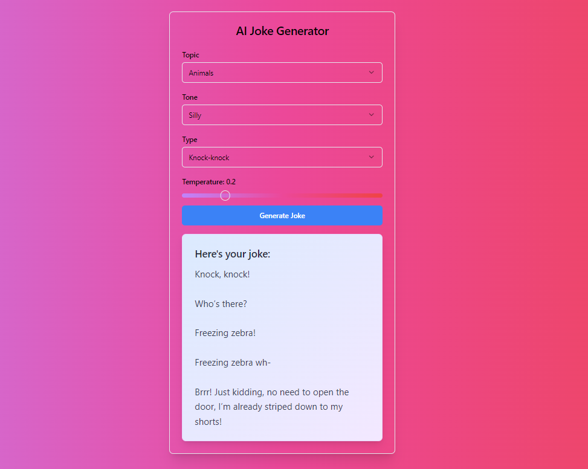

# Joke Generator Encode Club AI Bootcamp week-2 Project

[Live Demo](https://joke-generator-encode-club.vercel.app/)



## Project Description

The AI Joke Generator is an interactive web application that allows users to generate customized jokes using artificial intelligence. Built with NextJS, this project demonstrates the integration of AI models for creative content generation and provides a fun, user-friendly interface for joke enthusiasts.

## Features

- Customizable joke parameters (topic, tone, type, and creativity level)
- AI-powered joke generation
- Instant display of generated jokes
- Responsive design for various devices

## How to Use

1. Visit the [AI Joke Generator](https://joke-generator-encode-club.vercel.app/) website.
2. Select your desired parameters:
   - Topic (e.g., work, animals, food)
   - Tone (e.g., witty, sarcastic, silly)
   - Type of joke (e.g., pun, knock-knock, story)
   - Temperature (controls the creativity/randomness of the AI)
3. Click the "Generate Joke" button.
4. Enjoy your personalized AI-generated joke!

## Sample Jokes

### Work-related Witty Pun (Temperature: 0.5)

**Here's your joke:**

Why don't we ever hear about lazy workers at the Kelvin factory? Because everything there is kept at a steady 0.5 degrees, and those idle hands just can't handle the coolness!

### Animal-themed Silly Knock-Knock Joke (Temperature: 0.2)

**Here's your joke:**

Knock, knock! Who's there? Freezing zebra! Freezing zebra wh- Brrr! Just kidding, no need to open the door, I'm already striped down to my shorts!

## Local Development

To run this project locally, follow these steps:

1. Clone the repository:
   ```
   git clone https://github.com/yourusername/ai-joke-generator.git
   ```

2. Navigate to the project directory:
   ```
   cd ai-joke-generator
   ```

3. Install dependencies:
   ```
   npm install
   ```

4. Set up environment variables:
   - Create a `.env.local` file in the root directory
   - Add your AI API key:
     ```
     OPENAI_API_KEY=your_api_key_here
     ```

5. Run the development server:
   ```
   npm run dev
   ```

6. Open [http://localhost:3000](http://localhost:3000) in your browser to see the application.

## Project Structure

- `pages/`: Contains the main pages of the application
- `components/`: Reusable React components
- `styles/`: CSS and styling files
- `lib/`: Utility functions and API calls
- `public/`: Static assets

## Technologies Used

- NextJS
- React
- Tailwind CSS
- OpenAI API
- Groq API

## Acknowledgments

- Groq for providing the AI model
- The NextJS team for their excellent framework
- All contributors and joke enthusiasts who have helped improve this project

Enjoy generating jokes with AI!