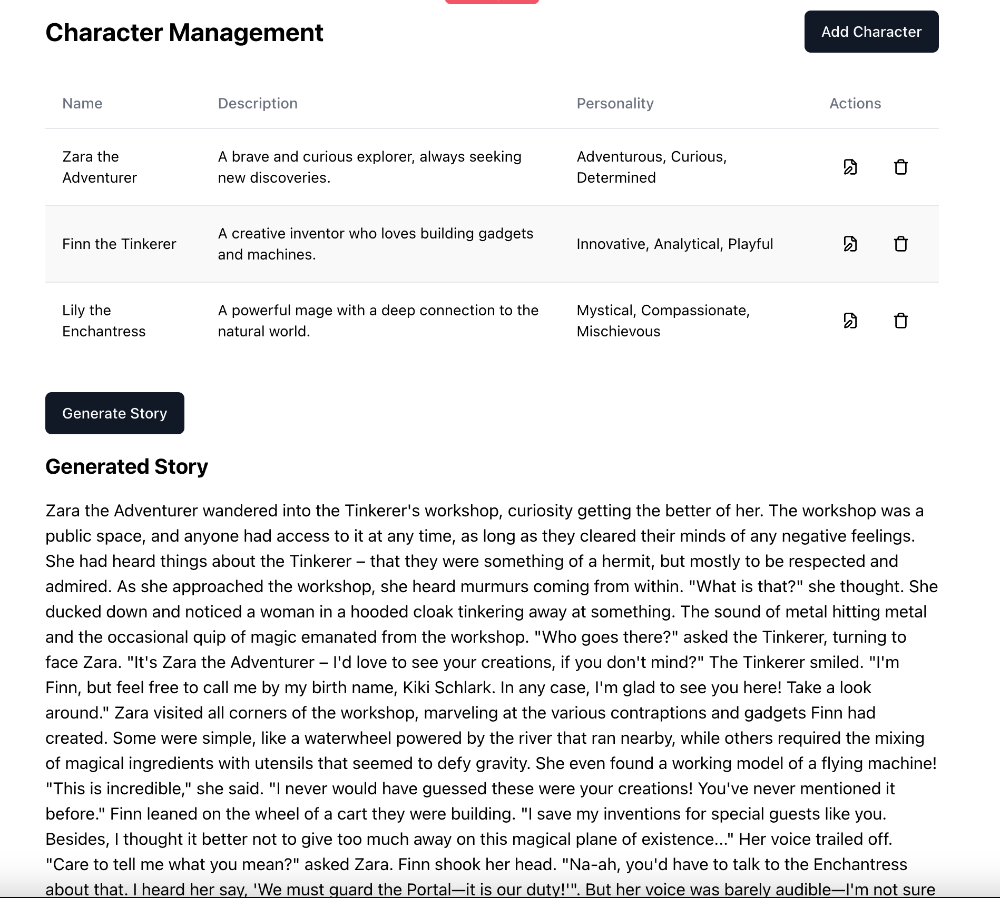

# Story Telling AI

## Project Description

Story Telling AI is a weekend project designed to consolidate knowledge in AI-assisted storytelling. This web application allows users to manage characters and generate stories using AI models.

## Features

- Character Management: Users can add, edit, and delete characters with names, descriptions, and personalities.
- Story Generation: AI-powered story creation using user-defined characters.
- Character Role Summary: After story generation, a summary of each character's role is provided.
- Model Experimentation: Test different AI models for story generation and compare outputs.

## Technical Details

- Built with NextJS, React, Vercel and TailwindCSS
- Uses various AI models for story generation
- Experiments with different context window sizes and model sizes

## Installation

1. Clone the repository
2. Install dependencies: `npm install`
3. Start the development server: `npm run dev`

## Usage

1. Add characters using the "Add Character" button
2. Edit or delete existing characters as needed
3. Click "Generate Story" to create a story using the defined characters
4. Review the generated story and character role summaries

## Project Goals

- Implement a functional character management system
- Experiment with different AI models for story generation
- Evaluate model performance in terms of character "memory" and context utilization
- Compare outputs across various model sizes and context window sizes

## Contributing

This project is part of a learning exercise. Contributions from team members are welcome. Please coordinate with your group members for any changes or additions.

## Results
